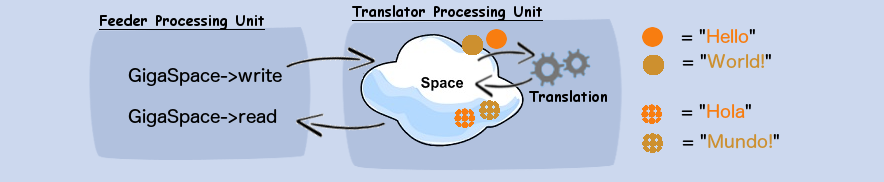
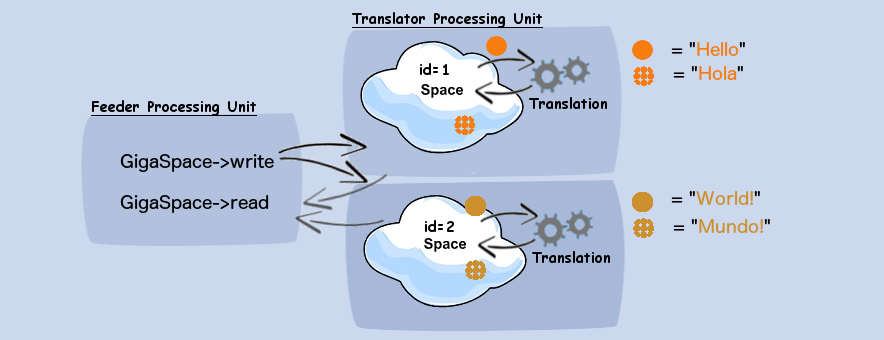

# Hola Mundo Example

This example builds on the simple `hello-world` example by presenting Processing Unit concepts.
Please make sure to familiarize yourself with the `hello-world` example.

This example consists of two processing units, one called `translator` and the other `feeder`.
A `processing unit` is a Spring based unit of packaging. There are two types - stateless and stateful.

- A `stateless processing unit` is a unit of work consisting of business logic.
- A `stateful processing unit` has an embedded data-grid instance running inside, with collocated business logic.

## Translator Processing Unit

The translator processing unit loads an embedded data-grid instance, and holds an English-to-Spanish dictionary.
The translator is responsible to process incoming "phrases" in English and translate them to Spanish.

## Phrase.java

`Phrase.java` found under `common` module is a common class used by both `feeder` and `translator`. 
It is a Plain Old Java Object (POJO) and is the entity behind the updates to the data-grid. 
It consists of getters and setters for the `englishPhrase` and `spanishPhrase` as the translation fields.
The `@SpaceId` on the `englishPhrase` is for uniqueness (similar to a Map key).

## Feeder Processing Unit

The feeder processing unit has a `PhraseFeeder.java` bean that writes "Hello" and "World!" as english phrases, 
and reads the processed (translated) entities back.

## @EventDriven + @Polling

The `EnglishToSpanishTranslator` bean (part of the translator module), serves as a listener on the 
data in the data-grid. This is specified by `@EventDriven` and `@Polling` annotations on the class.

The `SQLQuery<Phrase> untranslated()` method defines the template of the data to listen to, 
specified by `@EventTemplate` annotation.

The `Phrase translate(Phrase phrase)` method defines the processing to be done on the data, 
specified by `@SpaceDataEvent`.

When an entity of type `Phrase` is written to the data-grid, the polling mechanism polls for matching 
phrases (with a null spanishPhrase). A match is removed from the data-grid, invoking the `translate` 
method with the matching Phrase. The translated Phrase returned by this method is re-written to the 
data-grid (behind the scenes).

## Processing Unit XML - pu.xml

- The `translator/src/main/resources/META-INF/spring/pu.xml` is a Spring context XML configuration of 
an embedded data-grid, a translator bean, and annotation support.

- The `feeder/src/main/resources/META-INF/spring/pu.xml` is a Spring context XML configuration 
of the feeder bean loaded. 

## Running the example from the IDE

Import Maven `examples/hola-mundo/pom.xml` into your IDE of choice as a new maven project.

**note:** this section refers to IntelliJ IDE, but eclipse users can mimic the configuration settings

The `runConfigurations` folder consists of IntelliJ runtime configurations, which need to be copied 
to the `.idea/runConfigurations` directory under the IDE project structure (`.idea` is a hidden directory). 
In IntelliJ, these configurations will appear in the "Edit Configurations..." section.

A configuration consists of a Main class to run, and a module classpath to use.
The main class uses `org.openspaces.pu.container.integrated.IntegratedProcessingUnitContainer` - a 
built in container used to run a Processing Unit.


### Running with a single data-grid (1 instance)

- Run the translator (run confguration) -
  This will start an embedded data-grid, with a translator bean
  
- Run the feeder (run configuration) -
  This will write "Hello" and "World!" and read the translated Phrase entities.

#### output (feeder)
```
write - 'Hello'
write - 'World!'
read - ['Hola', 'Mundo!']
```

#### output (translator)
```
translated - Hello to Hola
translated - World! to Mundo!
```



### Running with a partitioned data-grid (2 instances)

Edit the run configuration of the translator, and add to the `Program Arguments` the following:
`-cluster schema=partitioned total_members=2,0`

This will configure the translator to start 2 data-grid partitioned instances (in the same JVM).
The "Hello" phrase will be written to one partition, and "World!" phrase will be written to the other.
The translator translation bean is active on each partition, translating matching phrases.

#### output (feeder)
```
write - 'Hello'
write - 'World!'
read - ['Hola', 'Mundo!']
```

#### output (of the two translators)
```
translated - Hello to Hola
translated - World! to Mundo!
```




To simulate this better, each instance can be loaded seperately (two JVMs)

- First instance (id=1)  : `-cluster schema=partitioned total_members=2,0 id=1`
- Second instance (id=2) : `-cluster schema=partitioned total_members=2,0 id=2`

#### output (of first translator)
```
translated - Hello to Hola
```

#### output (of second translator)
```
translated - World! to Mundo!
```

### Running with a partitioned data-grid (with backups for each partition)

Each partition instance can be assigned a backup, as follows:

1. Specify `total_members=2,1` for two partitions, each with a single backup.
2. Specify `backup_id=1` to load the backup instance of partition id=1 or id=2

## Running the example from the command line

Use Maven to compile and package the example (e.g. `mvn clean package`).

This will create the processing unit jars that can be referenced by `pu-instance.{sh,bat}`

From the ${XAP_HOME}/bin directory, run:

- ./pu-instance.sh -path ../examples/hola-mundo/translator/target/hola-mundo-translator.jar
- ./pu-instance.sh -path ../examples/hola-mundo/feeder/target/hola-mundo-feeder.jar

This will run the translator (as a single data-grid) and the feeder.

To start a partitioned translator (data-grid of 2 partitions), add the -cluster arguments: 

- ./pu-instance.sh -path ../examples/hola-mundo/translator/target/hola-mundo-translator.jar -cluster schema=partitioned total_members=2,0
